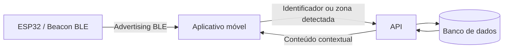
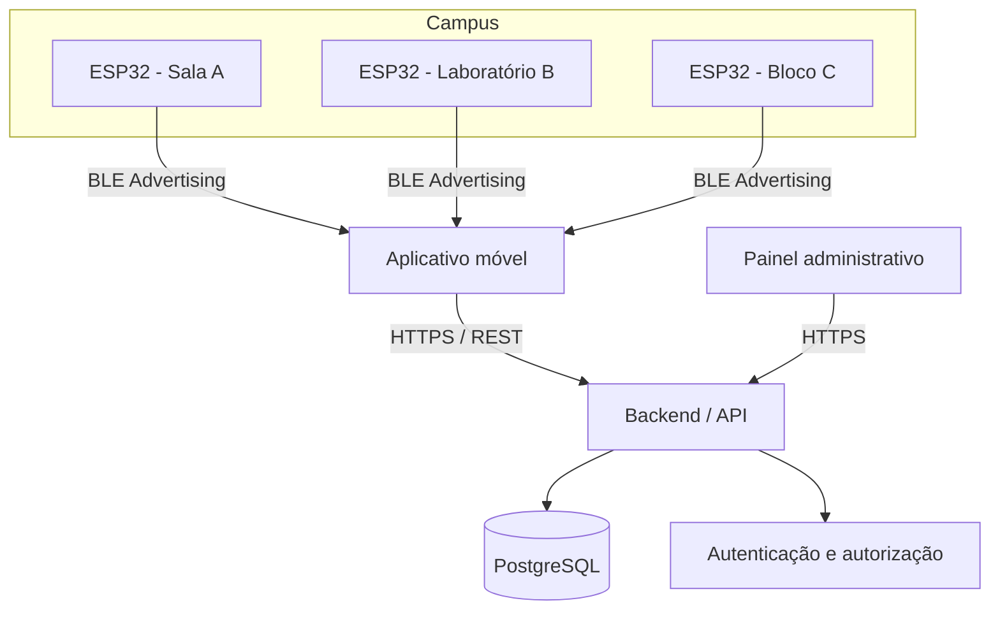

# Aplicação de Internet das Coisas na Disseminação Contextual de Informações em Ambientes Universitários utilizando ESP32 e Bluetooth

> Documento de escopo e fundamentação técnica para o TCC 1 — Ciência da Computação / UFPI.
>
> **Autor:** Kauã Marques do Nascimento  
> **Orientador:** Prof. Erico Meneses Leao

---

## 1. Visão geral do projeto

O projeto propõe o desenvolvimento de uma aplicação móvel sensível ao contexto para ambientes universitários. A solução utilizará dispositivos **ESP32** configurados para transmitir sinais **Bluetooth Low Energy (BLE)** em pontos físicos do campus. O aplicativo móvel detectará esses sinais, identificará a **zona ou ambiente aproximado** em que o usuário se encontra e consultará um servidor para exibir informações relevantes àquele local.

O objetivo central não é realizar rastreamento preciso e contínuo de pessoas, mas utilizar **proximidade e contexto espacial** para melhorar a entrega de informações acadêmicas e administrativas. Assim, ao entrar em uma sala, laboratório, corredor, bloco ou outro ponto previamente cadastrado, o usuário poderá receber informações relacionadas especificamente àquele ambiente.

> **Ajuste importante em relação à proposta inicial:** BLE/RSSI não deve ser descrito como mecanismo capaz de determinar, por si só, a “localização exata” do usuário. A intensidade do sinal Bluetooth sofre variações causadas por paredes, pessoas, obstáculos, orientação do aparelho e interferências. Para o escopo deste trabalho, é tecnicamente mais adequado tratar o problema como **detecção de proximidade e identificação de zonas/contextos**.

---

## 2. Problema de pesquisa

Ambientes universitários possuem grande quantidade de informações distribuídas entre sistemas acadêmicos, páginas institucionais, redes sociais, murais, grupos de mensagens e comunicações internas. Parte dessas informações possui forte relação com um espaço físico específico, porém geralmente é disponibilizada de maneira global e pouco contextualizada.

Exemplos:

- um aluno em frente a um laboratório pode precisar saber os horários disponíveis daquele laboratório;
- um estudante em uma sala de aula pode querer consultar monitorias relacionadas às disciplinas realizadas naquele local;
- um usuário entrando em determinado bloco pode receber avisos ou eventos específicos daquele centro;
- uma sala pode apresentar sua agenda, situação atual ou orientações de uso;
- um laboratório pode disponibilizar normas, responsáveis, horários e serviços relacionados ao próprio espaço.

A questão que orienta o projeto pode ser formulada como:

> **Como tecnologias de Internet das Coisas e Bluetooth Low Energy podem ser utilizadas para oferecer informações acadêmicas e administrativas contextualizadas de acordo com o ambiente físico em que o usuário se encontra dentro de uma universidade?**

---

## 3. Objetivo geral

Desenvolver e avaliar um sistema móvel sensível ao contexto capaz de disseminar informações acadêmicas e administrativas associadas a ambientes físicos universitários, utilizando dispositivos ESP32 e comunicação Bluetooth Low Energy para identificação de proximidade.

---

## 4. Objetivos específicos

1. Projetar um mecanismo de identificação de zonas físicas baseado na detecção de sinais BLE transmitidos por dispositivos ESP32.
2. Desenvolver uma aplicação móvel capaz de detectar os transmissores próximos e consultar informações associadas ao contexto identificado.
3. Desenvolver uma API/backend responsável pelo armazenamento, gerenciamento e distribuição dos conteúdos.
4. Criar um módulo administrativo para cadastro de locais, dispositivos, conteúdos e responsáveis.
5. Definir regras de autorização para determinar quais usuários podem criar, alterar, aprovar e publicar informações.
6. Avaliar a confiabilidade da identificação de contexto a partir da intensidade dos sinais BLE.
7. Avaliar a usabilidade da aplicação e a relevância das informações apresentadas aos usuários.
8. Investigar requisitos de privacidade, proteção de dados, acessibilidade e transparência aplicáveis à solução.

---

# 5. Escopo da aplicação

## 5.1 Para que a aplicação serve

A aplicação funciona como uma **camada contextual de acesso à informação do campus**. Em vez de exigir que o usuário procure manualmente informações em diferentes sistemas, o aplicativo utiliza o ambiente físico como um dos critérios para selecionar e apresentar conteúdos relevantes.

O sistema deverá ser capaz de responder a perguntas como:

- “Quais informações são relevantes para este local?”
- “O que está acontecendo neste bloco agora ou hoje?”
- “Qual é a agenda desta sala?”
- “Existem avisos associados a este laboratório?”
- “Quais eventos, monitorias ou serviços estão disponíveis nas proximidades?”

A aplicação **não tem como objetivo**, no escopo inicial:

- substituir integralmente sistemas acadêmicos institucionais;
- realizar rastreamento individual e permanente de alunos ou servidores;
- controlar presença acadêmica automaticamente;
- disponibilizar informações pessoais ou sigilosas;
- implementar navegação indoor centimétrica ou localização de alta precisão;
- atuar como sistema oficial de emergência sem homologação institucional específica.

---

## 5.2 Público-alvo

Os consumidores das informações podem ser divididos em quatro grupos principais:

### Estudantes

Principais consumidores da aplicação. Poderão consultar informações relacionadas a salas, disciplinas, monitorias, eventos, laboratórios, serviços e avisos.

### Professores

Poderão consumir informações e, caso autorizados, cadastrar ou sugerir conteúdos associados a disciplinas, salas, laboratórios e atividades acadêmicas.

### Técnicos e servidores administrativos

Poderão administrar conteúdos relacionados aos setores pelos quais são responsáveis, como avisos, horários, serviços, funcionamento e orientações.

### Visitantes

Poderão acessar conteúdos classificados como públicos, como localização de setores, eventos abertos, informações gerais e orientações de atendimento.

---

## 5.3 Informações que poderão ser disponibilizadas

O conteúdo deve ser organizado em categorias e possuir vínculo explícito com um ou mais locais físicos.

| Categoria | Exemplos | Público sugerido |
|---|---|---|
| Eventos | palestras, seminários, apresentações, semanas acadêmicas | público |
| Avisos institucionais | interrupções, mudanças de sala, comunicados locais | público ou autenticado |
| Monitorias | disciplina, monitor, horário e sala | comunidade acadêmica |
| Salas | agenda, disponibilidade, capacidade, finalidade | conforme política institucional |
| Laboratórios | horário, regras, responsável, equipamentos e serviços | comunidade acadêmica |
| Publicações acadêmicas | artigos, projetos, trabalhos, notícias de pesquisa | público |
| Serviços | secretaria, coordenação, biblioteca, assistência estudantil | público |
| Informações de acessibilidade | rotas acessíveis, elevadores, entradas e recursos disponíveis | público |
| Orientações locais | regras de uso, contatos, procedimentos e segurança | público |

O sistema deverá evitar armazenar ou divulgar, como conteúdo contextual comum:

- notas individuais;
- CPF, matrícula ou outros identificadores pessoais sem necessidade;
- dados médicos;
- dados disciplinares;
- frequência individual;
- informações classificadas ou sigilosas;
- conteúdos cujo acesso seja restrito em outros sistemas institucionais.

---

## 5.4 Fontes e bases de dados

A arquitetura deve permitir que as informações sejam provenientes de diferentes fontes. Para o protótipo do TCC, nem todas precisam ser integradas automaticamente.

### Base própria da aplicação

Banco de dados responsável por armazenar:

- locais e zonas cadastradas;
- identificadores dos beacons/ESP32;
- relação entre beacon e local;
- conteúdos contextuais;
- categorias de conteúdo;
- períodos de validade;
- permissões e responsáveis;
- histórico de publicação/alteração.

### Fontes institucionais que podem ser integradas futuramente

- calendário acadêmico;
- sistema acadêmico da universidade;
- agenda institucional;
- sistemas de reserva de salas;
- repositório institucional;
- páginas de departamentos e coordenações;
- diretórios de servidores e setores;
- sistemas de eventos.

Para o TCC, recomenda-se utilizar **dados controlados pelo próprio sistema**, com possibilidade de importação ou sincronização futura. Isso reduz a dependência de APIs institucionais que podem não estar disponíveis.

---

## 5.5 Modelo mínimo de dados

Uma estrutura inicial pode ser representada por:

```text
Local
├── id
├── nome
├── tipo
├── bloco
├── andar
├── descrição
└── status

Beacon
├── id
├── identificador_ble
├── local_id
├── potência_tx
├── intervalo_anuncio
└── ativo

Conteudo
├── id
├── titulo
├── descrição
├── categoria
├── autor_id
├── início_publicação
├── fim_publicação
├── visibilidade
└── status

ConteudoLocal
├── conteudo_id
└── local_id

Usuario
├── id
├── perfil
└── permissões
```

---

# 6. Política de acesso e distribuição das informações

## 6.1 As informações serão iguais para todos?

Não necessariamente.

O princípio adotado deve ser: **conteúdo público disponível de maneira igualitária para usuários em condições equivalentes, com personalização apenas quando houver justificativa funcional e base legal**.

A aplicação pode trabalhar com diferentes níveis:

### Conteúdo público

Visível para qualquer usuário próximo ao local, inclusive visitantes.

Exemplos: eventos públicos, horário de funcionamento, informações sobre setores e avisos gerais.

### Conteúdo da comunidade acadêmica

Exige autenticação institucional.

Exemplos: monitorias, comunicados internos ou informações acadêmicas que não sejam destinadas ao público externo.

### Conteúdo segmentado por autorização

Exibido apenas quando o usuário possuir determinada permissão ou vínculo.

Esse modelo deve ser utilizado com cautela e somente quando necessário. O sistema não deve criar discriminações arbitrárias entre usuários.

---

## 6.2 Governança do conteúdo

Para evitar informações incorretas ou publicações indevidas, cada conteúdo deve possuir:

- autor ou responsável;
- origem da informação;
- data de criação;
- período de validade;
- local associado;
- estado de publicação;
- possibilidade de revisão ou remoção;
- registro de alterações quando pertinente.

Perfis administrativos sugeridos:

- **Administrador do sistema:** infraestrutura e permissões gerais;
- **Gestor de conteúdo:** aprovação e moderação;
- **Responsável por setor/local:** publicação apenas em áreas autorizadas;
- **Usuário comum:** consumo das informações.

---

# 7. Aspectos legais, privacidade e transparência

## 7.1 Lei Geral de Proteção de Dados — LGPD

A Lei nº 13.709/2018 regula o tratamento de dados pessoais no Brasil. Caso a aplicação trate dados relacionados a uma pessoa identificada ou identificável, deverá observar princípios como finalidade, adequação, necessidade, transparência, segurança e prevenção.

Para reduzir riscos, a arquitetura deve seguir o princípio de **privacy by design**:

- não armazenar histórico de localização do usuário quando isso não for necessário;
- realizar, sempre que possível, a interpretação de proximidade no próprio aparelho;
- enviar ao backend somente o identificador do local ou beacon necessário para consultar conteúdos;
- coletar apenas dados indispensáveis;
- separar dados de autenticação de dados contextuais;
- utilizar comunicação HTTPS/TLS;
- definir períodos de retenção;
- manter registro de operações administrativas relevantes.

Uma decisão importante para o TCC é que **a detecção dos beacons não precisa resultar em rastreamento centralizado**. O smartphone pode identificar localmente o beacon mais relevante e solicitar ao servidor apenas os conteúdos daquele contexto.

---

## 7.2 Lei de Acesso à Informação — LAI

A Lei nº 12.527/2011 disciplina o acesso a informações públicas e é particularmente relevante por se tratar de uma universidade pública.

A existência da LAI, entretanto, não significa que todo dado institucional possa ser publicado irrestritamente. Informações públicas devem ser diferenciadas de dados pessoais, informações de acesso restrito e conteúdos cujo sigilo seja legalmente protegido.

A aplicação deve priorizar a disseminação de informações institucionais cujo caráter público ou interno esteja claramente definido.

---

## 7.3 Acessibilidade

A Lei Brasileira de Inclusão — Lei nº 13.146/2015 — estabelece requisitos de acessibilidade também para sistemas e conteúdos digitais mantidos por órgãos públicos.

A interface deve considerar:

- compatibilidade com leitores de tela;
- textos com boa legibilidade;
- navegação que não dependa exclusivamente de cor;
- tamanho de fonte ajustável;
- descrições adequadas de elementos visuais;
- linguagem clara;
- possibilidade de uso sem depender exclusivamente da identificação automática por Bluetooth.

A aplicação deve possuir uma alternativa de navegação manual por blocos, salas ou setores. Isso também ajuda usuários que estejam com Bluetooth desativado, sem permissão ou utilizando aparelhos incompatíveis.

---

# 8. Trabalhos relacionados e literatura científica

A literatura encontrada posiciona o projeto em três áreas principais: **computação sensível ao contexto**, **localização indoor por BLE** e **Smart Campus/IoT**.

## 8.1 Dey (2001) — Context-aware computing

Dey apresenta uma das definições clássicas de contexto em computação e discute como aplicações podem utilizar informações contextuais para adaptar seu comportamento.

**Relação com o projeto:** fundamenta a ideia de que localização, ambiente e situação podem ser utilizados para selecionar automaticamente informações relevantes ao usuário.

**Referência:**

DEY, A. K. *Understanding and Using Context*. Personal and Ubiquitous Computing, v. 5, n. 1, p. 4–7, 2001. DOI: 10.1007/s007790170019.

---

## 8.2 Lee, Lee e Kwan (2017) — Serviços baseados em localização em contexto universitário

O estudo apresenta um serviço baseado em localização voltado a atividades indoor em uma universidade, utilizando um modelo semântico para organizar, compartilhar e consultar informações relacionadas ao espaço.

**Relação com o projeto:** reforça a viabilidade de utilizar o ambiente universitário como contexto para seleção de informações e serviços.

**Referência:**

LEE, K.; LEE, J.; KWAN, M.-P. *Location-based service using ontology-based semantic queries: A study with a focus on indoor activities in a university context*. Computers, Environment and Urban Systems, v. 62, p. 41–52, 2017. DOI: 10.1016/j.compenvurbsys.2016.10.009.

---

## 8.3 Towards Context-aware Surveys Using Bluetooth Beacons (2016)

O trabalho utiliza dispositivos BLE para inferir localização e contexto de uso e adaptar dinamicamente formulários apresentados aos usuários.

**Relação com o projeto:** demonstra a utilização de beacons Bluetooth como gatilhos de contexto, conceito muito próximo da proposta deste TCC.

**Referência:**

*Towards Context-aware Surveys Using Bluetooth Beacons*. Procedia Computer Science, v. 83, p. 42–49, 2016. DOI: 10.1016/j.procs.2016.04.097.

---

## 8.4 Intelligent Beacon Location and Fingerprinting (2019)

O estudo investiga o uso de BLE e técnicas de fingerprinting para localização indoor em um campus universitário. Os autores analisam características de propagação do sinal e demonstram que a intensidade do BLE pode ser utilizada para estimar posição, embora existam limitações e variações ambientais.

**Relação com o projeto:** fornece base para discutir RSSI, posicionamento indoor, disposição de beacons e necessidade de calibração.

**Referência:**

*Intelligent beacon location and fingerprinting*. Procedia Computer Science, v. 151, p. 9–16, 2019. DOI: 10.1016/j.procs.2019.04.005.

---

## 8.5 A Low Energy IoT Application Using Beacon for Indoor Localization (2021)

O trabalho analisa métodos e tecnologias de localização indoor em aplicações IoT e propõe uma solução baseada em BLE.

**Relação com o projeto:** ajuda a justificar a escolha do BLE pelo baixo consumo energético, custo e aplicabilidade em ambientes internos.

**Referência:**

*A Low Energy IoT Application Using Beacon for Indoor Localization*. Applied Sciences, v. 11, n. 11, 4902, 2021. DOI: 10.3390/app11114902.

---

## 8.6 Cavus et al. (2022) — IoT em Smart Campus

A revisão sistemática analisa aplicações de IoT em campus inteligentes e identifica IoT, computação em nuvem, Big Data e inteligência artificial como tecnologias recorrentes nesse contexto.

**Relação com o projeto:** posiciona a proposta dentro da área de Smart Campus e demonstra que universidades são ambientes relevantes para experimentação e aplicação de IoT.

**Referência:**

CAVUS, N. et al. *Internet of Things and Its Applications to Smart Campus: A Systematic Literature Review*. International Journal of Interactive Mobile Technologies, v. 16, n. 23, p. 17–35, 2022. DOI: 10.3991/ijim.v16i23.36215.

---

## 8.7 Connected University System (2023)

O trabalho apresenta a evolução de um sistema de universidade conectada baseado em IoT, incluindo um subsistema de navegação indoor por beacons Bluetooth e fingerprinting.

**Relação com o projeto:** é um caso muito próximo do contexto do TCC, pois utiliza beacons em edifícios universitários, aplicação móvel e serviços de localização.

**Referência:**

*A Development of an IoT-Based Connected University System: Progress Report*. Sensors, v. 23, n. 6, 2875, 2023. DOI: 10.3390/s23062875.

---

## 8.8 BLE Beacon-Based IoT Localization em campus (2023)

O estudo desenvolve e avalia uma infraestrutura de localização indoor baseada em BLE para melhorar a mobilidade de pessoas com deficiência dentro de um campus universitário. O trabalho também avalia posicionamento físico dos beacons e variações de RSSI.

**Relação com o projeto:** além da localização indoor, acrescenta uma perspectiva importante de acessibilidade e demonstra que a disposição dos transmissores afeta diretamente a qualidade do sistema.

**Referência:**

*Empowering Accessibility: BLE Beacon-Based IoT Localization*. Electronics, v. 12, n. 19, 4012, 2023. DOI: 10.3390/electronics12194012.

---

## 8.9 Revisões recentes de Smart Campus

Revisões sistemáticas recentes reforçam que arquiteturas de Smart Campus combinam sensores/IoT, aplicações móveis, processamento em nuvem ou edge, integração de dados e mecanismos de governança.

Esses trabalhos também apontam desafios recorrentes em:

- interoperabilidade;
- privacidade;
- segurança;
- integração entre sistemas institucionais;
- escalabilidade;
- governança dos dados.

Esses pontos podem ser utilizados para justificar as decisões arquiteturais e as limitações assumidas no TCC.

---

# 9. Fundamentação tecnológica

## 9.1 Internet das Coisas (IoT)

IoT descreve ecossistemas nos quais dispositivos físicos possuem capacidade de identificação, comunicação, sensoriamento e/ou atuação integrada a sistemas computacionais.

Neste projeto, os dispositivos físicos não precisam armazenar o conteúdo acadêmico. Sua principal função é atuar como **âncoras de contexto**: cada ESP32 transmite um identificador BLE associado, no backend, a determinado local ou zona.

Fluxo conceitual:



---

## 9.2 Bluetooth Low Energy

Bluetooth Low Energy é adequado para dispositivos que precisam transmitir pequenos pacotes de dados com baixo consumo de energia.

No projeto, o ESP32 poderá operar principalmente em modo de **advertising**, transmitindo periodicamente um identificador. O aplicativo realiza o **scanning** desses anúncios e mede informações como RSSI.

Vantagens:

- baixo custo;
- ampla disponibilidade em smartphones;
- baixo consumo em comparação com comunicação Bluetooth clássica contínua;
- fácil implantação;
- possibilidade de identificar proximidade sem necessidade de GPS.

Limitações:

- RSSI varia significativamente em ambientes internos;
- paredes e pessoas atenuam o sinal;
- diferentes modelos de smartphone podem apresentar leituras diferentes;
- proximidade não equivale automaticamente a distância exata;
- sistemas Android e iOS possuem restrições de permissões e execução em segundo plano.

---

## 9.3 ESP32

O ESP32 possui suporte nativo a Bluetooth Low Energy e pode operar como transmissor de advertising BLE. O ESP-IDF disponibiliza pilhas como Bluedroid e NimBLE, sendo NimBLE especialmente interessante quando a aplicação utiliza apenas BLE e deseja menor consumo de memória.

Para este TCC, cada ESP32 pode transmitir um identificador lógico relacionado a uma zona física.

Exemplo:

```text
ESP32-A01 -> Bloco A / Sala 01
ESP32-A02 -> Bloco A / Laboratório 02
ESP32-B01 -> Bloco B / Hall principal
```

O mapeamento real deve permanecer no servidor, evitando codificar informações complexas diretamente no beacon.

---

# 10. Métodos possíveis para identificação do contexto

Existem diferentes níveis de complexidade.

## 10.1 Método recomendado para o MVP: beacon mais relevante + limiar de RSSI

1. O smartphone escaneia beacons próximos por uma janela de tempo.
2. Agrupa leituras por identificador.
3. Calcula uma medida suavizada do RSSI.
4. Ignora sinais abaixo de um limiar mínimo.
5. Seleciona o beacon com maior intensidade média/mediana.
6. Mantém uma margem temporal para evitar troca constante de zona.

Exemplo conceitual:

```text
Beacon A: -51 dBm
Beacon B: -73 dBm
Beacon C: -88 dBm

Zona selecionada: A
```

É recomendável utilizar média móvel, mediana ou filtro semelhante em vez de confiar em uma única leitura.

### Vantagens

- implementação simples;
- suficiente para identificar salas ou zonas bem separadas;
- menor custo computacional;
- fácil de avaliar experimentalmente.

### Desvantagens

- pode falhar em locais adjacentes;
- exige calibração dos transmissores e limiares.

---

## 10.2 Fingerprinting BLE

Nesse método, o ambiente é previamente mapeado. Em diferentes pontos são registradas assinaturas de RSSI de vários beacons. Durante a utilização, a leitura atual é comparada com a base de fingerprints.

### Vantagens

- normalmente mais robusto que converter RSSI diretamente em distância;
- pode diferenciar regiões próximas.

### Desvantagens

- exige etapa de calibração;
- alterações no ambiente podem exigir novo levantamento;
- aumenta a complexidade do TCC.

Pode ser utilizado como evolução ou experimento comparativo.

---

## 10.3 Trilateração por RSSI

Utiliza estimativas de distância em relação a múltiplos beacons.

Embora seja conhecida, essa abordagem deve ser tratada com cautela porque a conversão de RSSI em distância é altamente sensível às características do ambiente interno.

Para o problema deste TCC, **identificação de zona** tende a ser mais adequada do que tentar obter coordenadas exatas.

---

# 11. Arquitetura proposta



### Componentes

#### ESP32

- emissão BLE;
- identificador único;
- potência configurável;
- baixo volume de processamento.

#### Aplicativo móvel

- scanning BLE;
- tratamento do RSSI;
- identificação da zona;
- consulta à API;
- apresentação das informações;
- fallback para seleção manual de local.

#### Backend

- autenticação;
- controle de acesso;
- CRUD de locais;
- CRUD de beacons;
- CRUD de conteúdo;
- regras de validade e visibilidade;
- API para consulta contextual.

#### Painel administrativo

- gestão de zonas e dispositivos;
- criação/edição de conteúdos;
- definição de período de publicação;
- moderação e aprovação.

---

# 12. Tecnologias candidatas

As escolhas abaixo são sugestões e podem ser ajustadas conforme experiência da equipe e requisitos do protótipo.

| Camada | Opções | Recomendação para protótipo |
|---|---|---|
| Firmware ESP32 | ESP-IDF / Arduino Framework | ESP-IDF ou Arduino com BLE advertising |
| Aplicativo | Flutter / React Native / Android nativo | Flutter ou Android nativo |
| Backend | NestJS / FastAPI / Spring Boot | NestJS ou FastAPI |
| Banco | PostgreSQL / MySQL | PostgreSQL |
| Cache opcional | Redis | somente se necessário |
| API | REST / GraphQL | REST |
| Autenticação | JWT + login institucional futuro | JWT no protótipo |
| Infraestrutura | Docker | recomendado |
| Administração | Web app | React/Vue ou mesma stack já utilizada |

### Observação sobre aplicativo multiplataforma

Caso o foco experimental seja BLE, iniciar pelo **Android** pode reduzir riscos de desenvolvimento. Sistemas móveis impõem regras diferentes para scanning Bluetooth, permissões e execução em segundo plano. Uma versão multiplataforma pode ser mantida como objetivo, mas não deve comprometer a avaliação central do TCC.

---

# 13. Requisitos funcionais iniciais

- **RF01:** cadastrar locais físicos.
- **RF02:** cadastrar beacons/ESP32 e vinculá-los a locais.
- **RF03:** cadastrar conteúdos contextuais.
- **RF04:** associar um conteúdo a um ou mais locais.
- **RF05:** definir início e fim da validade de um conteúdo.
- **RF06:** definir nível de visibilidade do conteúdo.
- **RF07:** detectar beacons BLE próximos pelo aplicativo.
- **RF08:** determinar a zona mais provável do usuário.
- **RF09:** consultar a API a partir da zona identificada.
- **RF10:** apresentar conteúdos ordenados por relevância e validade.
- **RF11:** permitir navegação manual por local.
- **RF12:** permitir administração apenas por usuários autorizados.
- **RF13:** registrar autoria e alterações administrativas importantes.

---

# 14. Requisitos não funcionais

- **RNF01 — Privacidade:** não armazenar histórico de localização sem necessidade explícita.
- **RNF02 — Segurança:** comunicação entre app e backend deve utilizar HTTPS.
- **RNF03 — Acessibilidade:** interface compatível com boas práticas de acessibilidade móvel.
- **RNF04 — Desempenho:** a troca de contexto não deve provocar atrasos perceptíveis excessivos.
- **RNF05 — Robustez:** pequenas oscilações de RSSI não devem causar mudança constante entre zonas.
- **RNF06 — Auditabilidade:** conteúdos administrativos devem possuir origem/responsável identificável.
- **RNF07 — Escalabilidade:** novos locais e beacons devem poder ser adicionados sem alteração estrutural no aplicativo.
- **RNF08 — Disponibilidade:** falhas temporárias de rede devem ser tratadas sem bloquear completamente a interface.

---

# 15. Metodologia de desenvolvimento e avaliação

## Etapa 1 — Levantamento bibliográfico

Realizar revisão da literatura sobre:

- computação sensível ao contexto;
- IoT em Smart Campus;
- localização indoor;
- BLE beacons;
- RSSI e fingerprinting;
- privacidade e localização;
- acessibilidade digital.

Bases recomendadas:

- IEEE Xplore;
- ACM Digital Library;
- ScienceDirect;
- SpringerLink;
- Scopus, caso disponível institucionalmente;
- Google Scholar como mecanismo complementar de descoberta.

String inicial de busca:

```text
("smart campus" OR "smart university" OR university)
AND
("Bluetooth Low Energy" OR BLE OR beacon)
AND
("context-aware" OR "location-based" OR "indoor positioning")
```

---

## Etapa 2 — Prototipação do beacon

- configurar um ESP32 para advertising BLE;
- definir potência e intervalo de transmissão;
- testar detecção com diferentes smartphones;
- registrar RSSI em diferentes distâncias e condições.

---

## Etapa 3 — Experimento de identificação de zonas

Selecionar um ambiente controlado, por exemplo:

- duas ou três salas;
- um corredor;
- um laboratório.

Coletar leituras em diferentes pontos e verificar:

- taxa de identificação correta da zona;
- falsos positivos;
- tempo médio para reconhecer mudança de ambiente;
- estabilidade da classificação;
- influência de obstáculos e fluxo de pessoas.

### Métricas possíveis

```text
Acurácia de zona = identificações corretas / total de testes

Tempo de detecção = instante da entrada na zona até classificação estável

Taxa de transição incorreta = trocas incorretas de contexto / total de transições
```

---

## Etapa 4 — Desenvolvimento da aplicação completa

Implementar:

- app móvel;
- backend;
- banco de dados;
- painel administrativo;
- autenticação;
- fluxo de publicação.

---

## Etapa 5 — Avaliação com usuários

Além da avaliação técnica do BLE, o sistema pode ser avaliado com usuários por meio de tarefas e questionários.

Possíveis critérios:

- facilidade de uso;
- utilidade percebida;
- relevância das informações;
- tempo para encontrar uma informação;
- satisfação;
- clareza da interface.

Uma opção consolidada para avaliação de usabilidade é o **System Usability Scale (SUS)**.

---

# 16. Hipóteses e questões de pesquisa

### RQ1

É possível identificar de maneira suficientemente confiável a zona física aproximada de um usuário em um ambiente universitário utilizando sinais BLE transmitidos por ESP32?

### RQ2

A utilização do contexto espacial reduz o esforço necessário para o usuário encontrar informações relevantes sobre o ambiente universitário?

### RQ3

Quais configurações de potência, intervalo de advertising e tratamento de RSSI apresentam melhor estabilidade para o cenário estudado?

### RQ4

Quais mecanismos de privacidade e controle de acesso são necessários para disponibilizar informações contextuais sem realizar rastreamento desnecessário dos usuários?

---

# 17. Contribuição esperada

A principal contribuição do trabalho não é simplesmente utilizar ESP32 ou Bluetooth, mas propor e avaliar uma **arquitetura de disseminação contextual de informações universitárias** baseada em proximidade física.

O trabalho pode produzir como resultados:

1. uma arquitetura para associação entre zonas físicas e informações digitais;
2. um protótipo funcional envolvendo ESP32, aplicativo e backend;
3. um método de identificação de contexto baseado em BLE;
4. uma avaliação experimental da precisão/estabilidade do mecanismo;
5. uma análise de requisitos de privacidade, governança e acessibilidade;
6. recomendações para implantação futura em escala maior no campus.

---

# 18. Diferencial em relação a trabalhos de localização indoor

Grande parte dos trabalhos com BLE concentra-se em responder:

> “Onde exatamente o usuário está?”

Este projeto pode assumir uma abordagem diferente:

> “Qual contexto físico é suficientemente provável para determinar quais informações são relevantes agora?”

Essa mudança reduz a exigência por localização de alta precisão e aproxima a solução do objetivo real da aplicação: **disseminar informação útil no momento e local adequados**.

---

# 19. Riscos técnicos e estratégias de mitigação

| Risco | Impacto | Mitigação |
|---|---|---|
| RSSI instável | zona incorreta | média/mediana móvel, hysteresis e calibração |
| interferência entre salas próximas | alternância de contexto | ajuste de potência e posicionamento físico |
| permissões Bluetooth negadas | app não detecta contexto | seleção manual de local |
| indisponibilidade da internet | conteúdo não carrega | cache local dos últimos conteúdos |
| informação desatualizada | perda de confiança | validade obrigatória e responsável pelo conteúdo |
| excesso de notificações | rejeição do usuário | priorizar consulta contextual e notificações configuráveis |
| tratamento desnecessário de localização | risco à privacidade | processamento local e minimização de dados |
| escopo excessivo | atraso no TCC | limitar MVP a poucas zonas e categorias |

---

# 20. Escopo recomendado para o MVP do TCC

Para manter o projeto executável dentro do período acadêmico, recomenda-se validar a solução em uma área limitada do campus.

### Ambiente

- 1 bloco ou laboratório;
- aproximadamente 3 a 6 zonas;
- 1 ESP32 por zona ou configuração experimental equivalente.

### Tipos de conteúdo

- avisos;
- eventos;
- monitorias;
- informações de salas/laboratórios.

### Funcionalidades essenciais

- detectar contexto via BLE;
- consultar conteúdo por local;
- mostrar conteúdo ao usuário;
- painel administrativo simples;
- controle de validade das publicações;
- autenticação para administradores;
- fallback de seleção manual.

### Funcionalidades que podem ficar para trabalhos futuros

- integração completa com sistemas institucionais;
- notificações push avançadas;
- navegação indoor ponto a ponto;
- machine learning para localização;
- integração com sensores ambientais;
- analytics de ocupação;
- implantação em múltiplos campi.

---

# 21. Critérios de sucesso

O protótipo poderá ser considerado tecnicamente bem-sucedido se demonstrar que:

1. os ESP32 podem ser detectados de forma estável nos ambientes escolhidos;
2. o algoritmo consegue identificar corretamente a zona na maior parte dos cenários de teste;
3. o aplicativo recupera conteúdos coerentes com o contexto identificado;
4. oscilações do sinal não provocam mudanças excessivas de contexto;
5. os usuários conseguem acessar as mesmas informações também por mecanismo manual;
6. a solução evita armazenar localização individual sem necessidade;
7. a arquitetura permite adicionar novos locais e conteúdos sem alterar o núcleo do aplicativo.

---

# 22. Referências iniciais

1. DEY, A. K. **Understanding and Using Context**. *Personal and Ubiquitous Computing*, 5(1), 4–7, 2001. DOI: https://doi.org/10.1007/s007790170019
2. LEE, K.; LEE, J.; KWAN, M.-P. **Location-based service using ontology-based semantic queries: A study with a focus on indoor activities in a university context**. *Computers, Environment and Urban Systems*, 62, 41–52, 2017. DOI: https://doi.org/10.1016/j.compenvurbsys.2016.10.009
3. **Towards Context-aware Surveys Using Bluetooth Beacons**. *Procedia Computer Science*, 83, 42–49, 2016. DOI: https://doi.org/10.1016/j.procs.2016.04.097
4. **Intelligent beacon location and fingerprinting**. *Procedia Computer Science*, 151, 9–16, 2019. DOI: https://doi.org/10.1016/j.procs.2019.04.005
5. **A Low Energy IoT Application Using Beacon for Indoor Localization**. *Applied Sciences*, 11(11), 4902, 2021. DOI: https://doi.org/10.3390/app11114902
6. CAVUS, N. et al. **Internet of Things and Its Applications to Smart Campus: A Systematic Literature Review**. *International Journal of Interactive Mobile Technologies*, 16(23), 17–35, 2022. DOI: https://doi.org/10.3991/ijim.v16i23.36215
7. **A Development of an IoT-Based Connected University System: Progress Report**. *Sensors*, 23(6), 2875, 2023. DOI: https://doi.org/10.3390/s23062875
8. **Empowering Accessibility: BLE Beacon-Based IoT Localization**. *Electronics*, 12(19), 4012, 2023. DOI: https://doi.org/10.3390/electronics12194012
9. NOVIANSYAH, B.; LESTARY, L. **Internet of Thing for Smart Campus: Systematic Literature Review**. *Advances in Engineering Research*, 2024. DOI: https://doi.org/10.2991/978-94-6463-364-1_59
10. LÓPEZ-GOYEZ, J. P.; GONZÁLEZ-BRIONES, A.; GUAYTARILLA, J. **Smart Campus in Higher Education: A Systematic Review of Intelligent Technologies, Information Systems, and Sustainable Digital Ecosystems**. *Applied Sciences*, 16(14), 7277, 2026. DOI: https://doi.org/10.3390/app16147277

## Legislação e documentação técnica

11. BRASIL. **Lei nº 13.709, de 14 de agosto de 2018 — Lei Geral de Proteção de Dados Pessoais (LGPD)**. Presidência da República. https://www.planalto.gov.br/ccivil_03/_ato2015-2018/2018/lei/l13709.htm
12. BRASIL. **Lei nº 12.527, de 18 de novembro de 2011 — Lei de Acesso à Informação (LAI)**. Presidência da República. https://www.planalto.gov.br/ccivil_03/_ato2011-2014/2011/lei/l12527.htm
13. BRASIL. **Lei nº 13.146, de 6 de julho de 2015 — Lei Brasileira de Inclusão da Pessoa com Deficiência**. Presidência da República. https://www.planalto.gov.br/ccivil_03/_ato2015-2018/2015/lei/l13146.htm
14. ESPRESSIF SYSTEMS. **ESP-IDF Programming Guide — Bluetooth Low Energy**. https://docs.espressif.com/projects/esp-idf/en/stable/esp32/api-guides/ble/index.html

---

# 23. Resumo executivo do escopo definido

Em sua versão de TCC, o projeto será uma aplicação de **Smart Campus** voltada à **disseminação contextual de informações**. ESP32 instalados em zonas específicas atuarão como beacons BLE. O smartphone identificará localmente os transmissores próximos, estimará a zona mais provável e solicitará ao servidor conteúdos associados àquele contexto.

O sistema priorizará conteúdos acadêmicos e administrativos de baixo risco — como eventos, avisos, monitorias, serviços e informações sobre espaços — e evitará dados pessoais ou sigilosos. A arquitetura será desenhada para minimizar coleta de localização e permitir acesso manual às mesmas informações, garantindo maior privacidade, acessibilidade e inclusão.

Do ponto de vista científico, o trabalho será fundamentado em computação sensível ao contexto, IoT/Smart Campus e métodos de identificação indoor baseados em BLE. A avaliação deverá medir tanto o desempenho técnico da identificação de zonas quanto a utilidade e usabilidade da apresentação contextual de informações.
